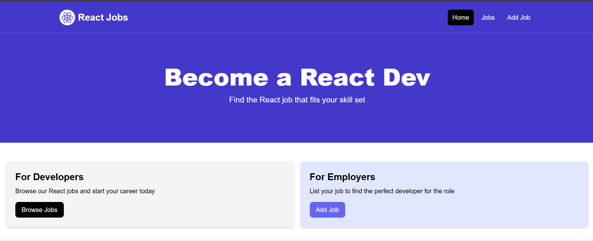
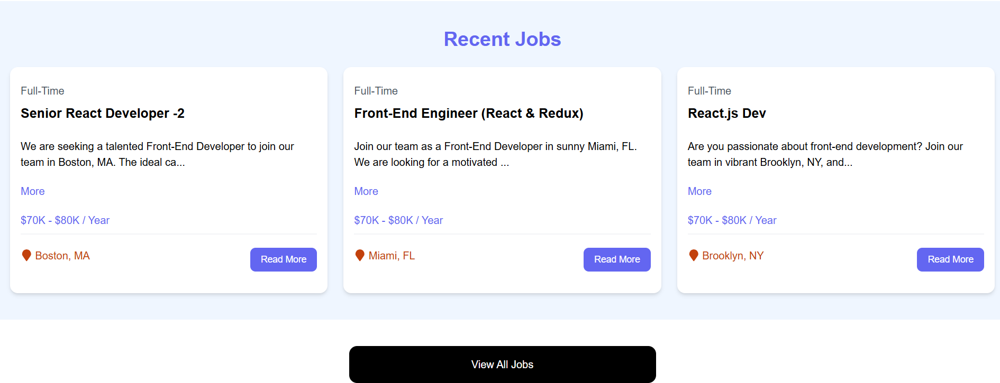
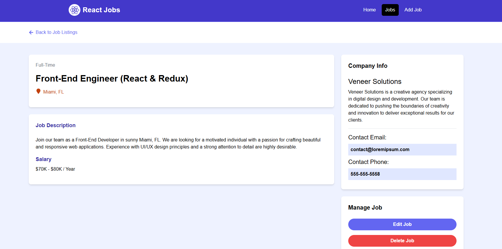
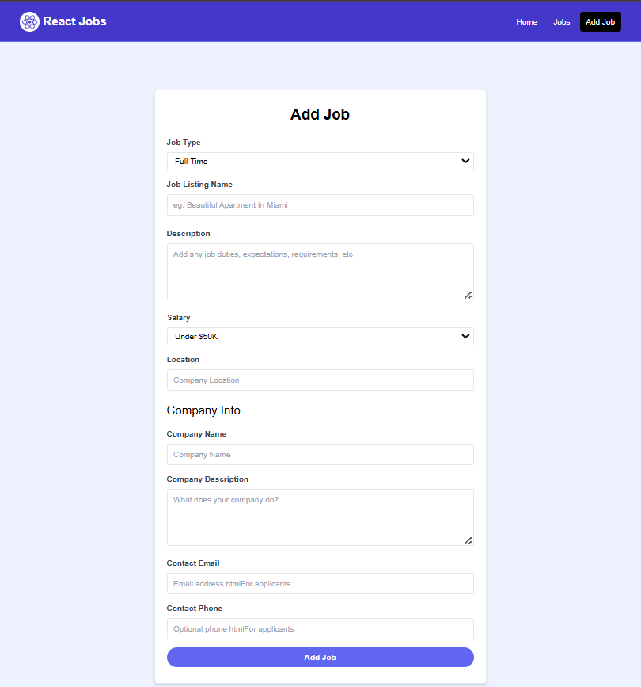

# 💼 React Job Board App (Vite + Tailwind + Express)

A **Job Board Web Application** built using **React**, **Vite**, **Tailwind CSS**, **React Router**, and a custom **Express.js backend**.  
This project was created as part of my React learning journey, exploring topics like routing, component composition, form handling, and CRUD operations with a real backend.

🌍 **Live Demo**: [React Jobs](https://react-jobs-frontend-70jl.onrender.com/)

---

## 📸 Screenshots

### Home Page


### Job Listings


### Job Details


### Add Job



---

## 🚀 Tech Stack

- ⚛️ [React](https://reactjs.org/)  
- ⚡ [Vite](https://vitejs.dev/)  
- 🎨 [Tailwind CSS](https://tailwindcss.com/)  
- 🧭 [React Router](https://reactrouter.com/)  
- 📡 [Express.js](https://expressjs.com/) (instead of JSON Server)  
- 🎉 [React Toastify](https://fkhadra.github.io/react-toastify/)  
- 💎 [React Icons](https://react-icons.github.io/react-icons/)  

---

## 📚 Features & Learnings

### 🔧 Setup & Configuration
- ✅ Project scaffolded with **Vite** for fast development.  
- ✅ Integrated **Tailwind CSS** for utility-first styling.  
- ✅ Added `.env.production` for backend API integration.  

### 🧱 Components & JSX
- ✅ Built reusable components: `Navbar`, `Hero`, `JobListings`, `JobListing`.  
- ✅ Practiced props, default props, and component composition.  

### 🌐 API & Data Handling
- ✅ Replaced JSON Server with a real **Express.js backend**.  
- ✅ Created REST API routes for CRUD operations.  
- ✅ Connected frontend with backend using `fetch()` and async/await.  

### ✍️ Forms & CRUD Operations
- ✅ **Add Job** form with validation.  
- ✅ Implemented `POST`, `DELETE`, and `PUT` requests to Express backend.  
- ✅ Toast notifications for better UX.  

---

## 🧠 Core React Concepts Covered

| 🔑 Concept | 📘 Description |
|-----------|----------------|
| `useState()` | Local state management |
| `useEffect()` | Lifecycle hook for side effects & data fetching |
| `useParams()` | Extracting dynamic route values |
| Conditional Rendering | UI control based on state & data |
| Props | Parent-to-child data flow |
| Controlled Inputs | Form handling |
| CRUD with API | Create, Read, Update, Delete via Express backend |
| React Router | Multi-page SPA navigation |

---

## 📦 Project Setup (Run Locally)

### 1. Install Dependencies
Install dependencies for both client and server:

```bash
# Install client dependencies
cd client
npm install

# Install server dependencies
cd ../server
npm install
````

### 2. Configure Environment Variables

In `client/.env.production` add:

```
VITE_API_URL=https://react-jobs-backend-dux4.onrender.com
```

For local development, you can also use `.env`:

```
VITE_API_URL=http://localhost:5000
```

### 3. Start the Backend

From the `server` folder:

```bash
npm start
```

> Backend runs on [http://localhost:5000](http://localhost:5000)

### 4. Start the Frontend

From the `client` folder:

```bash
npm run dev
```

> Frontend runs on [http://localhost:5173](http://localhost:5173)

---

## 📚 Features & Learnings

* ✅ Dynamic Job Listings – view, add, edit, delete jobs
* ✅ REST API Integration with Express.js
* ✅ Form Handling using controlled inputs
* ✅ Routing with React Router (including 404 page)
* ✅ Toast Notifications for user feedback
* ✅ Responsive Design with Tailwind CSS

---

## 🚧 Future Improvements

* 🔍 Add job filtering by tags, location, or salary
* 📜 Pagination or infinite scroll
* 🔐 User authentication for job posting


